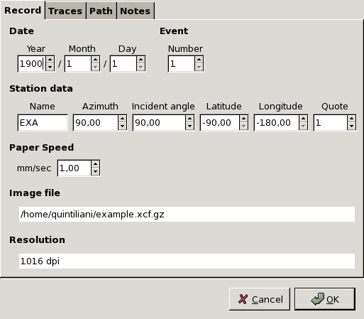
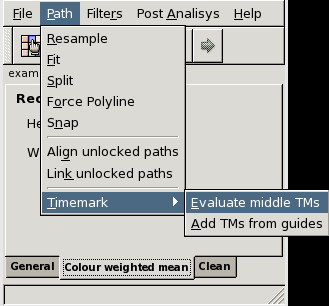

# Teseo2: Turn the Eldest Seismograms into the Electronic Original Ones
---
author:
- |
    **Stefano Pintore, Matteo Quintiliani**\
    *Istituto Nazionale di Geofisica e Vulcanologia, Roma,
    Italy*
bibliography:
- 'Teseo2UserManual.bib'
title: |
     **Teseo2 User Manual**\
    **T**urn the **E**ldest
    **S**eismograms into the **E**lectronic
    **O**riginal **O**nes –
    2.0.16 
...

\* \* \*\
This documentation needs further updates.\
*$ $Revision: 1.63 $ $– $ $Date:
2007/04/13 07:02:00 $ $*\
Please, check last revision at <http://sismos.ingv.it/teseo/>\

Introduction
============

This document is the user manual of
Teseo2 software – *Copyright
© 2005* – Stefano Pintore, Matteo Quintiliani.
*$ $Revision: 1.63 $ $– $ $Date:
2007/04/13 07:02:00 $ $.*

Teseo2 is a software tool for seismogram
digitization/vectorization and it is developed in the framework of the
Sismos project @sismoseos at Istituto Nazionale di Geofisica e
Vulcanologia (Italy). This name was inspired by the myth of Theseus and
it is also an acronym for ***T**urn the
**E**ldest **S**eismograms into the
**E**lectronic **O**riginal
**O**nes*.

Teseo2 is a plug–in for GIMP – GNU Image
Manipulation Program – that extends its functionalities for
seismological studies. The GIMP is a
multiplatform photo manipulation tool freely distributed. It works on
many operating systems, in many languages.

Teseo2 allows primarily for:

-   additional operations on the vectorized trace (i.e. resampling and
    alignment)

-   supervised vectorization algorithms (colour weighted mean)

-   analysis after trace vectorization, such as curvature correction and
    time realignment

-   trace import/export in several formats (such as
    *SAC*, *SVG*,
    *DXF*, *ASCII*,
    Timemarks distances).

In order to keep track of the stages and parameters of a seismogram
vectorization, Teseo2 is able to write this
information into the image saved in
*xcf* format.

Teseo2 is developed following the
–Source” philosophy and it is freely distributed under GPL
license. It is cross–platform and the sources, the binaries for Linux,
Windows and Mac OS X, are periodically updated on the Sismos web site.

Official web site: *<http://sismos.ingv.it/teseo/>*

Developer e–mail:
*[mailto:teseo@ingv.it](mailto:teseo@ingv.it)*

User mailing–list:
*[mailto:teseo-user@yahoogroups.com](mailto:teseo-user@yahoogroups.com)*

ML archive: *<http://groups.yahoo.com/group/teseo-user/>*

Installing Teseo
================

Before installing Teseo2 you need to install
GIMP 2.2. Teseo2 has
never been tested on GIMP 2.0.

Please refer to the official website at <http://www.gimp.org/>, user
manual @gimphelp and books @bunks, @kylander, for any information about
it.

Teseo2 is developed on Linux but binaries are
also available for other platforms such as Windows and Mac OS X. You can
be able to compile Teseo2 on every system
where GIMP has been successfully installed.
Sources and some binary distributions can be downloaded at the official
web site, <http://sismos.ingv.it/teseo/>

In this manual we provide basic information to install
Teseo2 plug-in. For specific information,
please follow instructions contained in the INSTALL file for your
distribution.

Teseo from Source
-----------------

Teseo2 is mostly developed in C language, one
library is written in Fortran. In order to compile
Teseo2 you need
*gcc*, *g77* and
*libg2c*.

In general, Teseo2 works with
GIMP 2.2, although version 2.2.6 or newer is
recommended. We develop Teseo2 using
*GTK+* and
*GLib*.
*GTK+* is a library for creating
graphical user interfaces.
*GLib* is a general-purpose
utility library, which provides many useful data types, macros, type
conversions, string utilities, file utilities, a main loop abstraction,
and so on. The versions of
*GTK+* and
*GLib* are the same used by
GIMP.

Moreover, Teseo2 use a
*GTK+* widget called
*GtkDataBox*which has been
designed to display large amounts of numerical data fast and easy.
Version greater than 0.4.0 is required. Please, refer to the section
[sec:credits] for downloading and documentation about
*GtkDataBox*.

Teseo2 sources are subdivided into three
separate modules: two libraries (*gtk–addons*,
*newuoa*) and the
GIMP plug-in
(*teseo–2*). Unpack the file
teseo–2.x.x.tar.gz and compile the source modules following this order:
*gtk–addons*,
*newuoa* and
*teseo–2*. You can use the stardard command
sequence:

**

```
  ./configure
  make
  make install
```

For *teseo–2*, you should launch the configure
script with the same *prefix* of gimp–2.2 and, optionally,
set the *datadir*. For example, if gimp–2.2 is configured
with *—prefix=/mydir*, you have to use:

**

```
  ./configure —prefix=/mydir —datadir=/mydir/share/gimp/2.0
```

Teseo for Linux
---------------

First of all, install GIMP. Version 2.2.6 or
newer is recommended.

Unpack the binary distribution from teseo–2.x.x–bin–linux.tar.gz and run
these commands to install Teseo2:

**

```
  cd teseo–2.x.x–bin–linux
  ./setup.sh linux
```

setup.sh needs gimptool–2.0 included in
GIMP distributions.

To uninstall run:

**

```
  cd teseo–2.x.x-bin–linux
  ./setup.sh linuxuninstall
```

Teseo for Windows
-----------------

-   **Pre-requisite**

    1.  Install gimp–2.2.6 or newer : files and instructions at
        <http://gimp-win.sourceforge.net/>

    2.  (Optional) Install gimp–help

-   **Install teseo–2**

    1.  Close GIMP

    2.  Extract teseo–2.x.x-setup.exe from the distributed
        teseo–2.x.x-setup.zip

    3.  Run teseo–2.x.x-setup.exe

    4.  Start GIMP

Teseo for Mac OS X
------------------

To install Teseo2 on Mac OS X you have 2
possibilities.

1.  Download DMG image that contains Gimp.app with teseo–2 bundled\
    (DMG image is about 72 MB)

2.  Download binary distribution pack and use shell script
    configuration:\
    (Distribution is about 1 MB)

    First of all, install GIMP. Version 2.2.6
    or newer is recommended.

    Unpack binary distribution teseo–2.x.x–bin–macosx.tar.gz

    **

```
      cd teseo–2.x.x–bin–macosx
      ./setup.sh macosx /Applications/Gimp.App
```

    To uninstall run:

    **

```
      cd teseo–2.x.x–bin–macosx
      ./setup.sh macosxuninstall /Applications/Gimp.App
```

    If *Gimp.app* doesn’t reside in
    *Applications* folder, change it with the correct path.

Getting started with Teseo
==========================

Teseo2 works only on grayscale images and it
could work on any image format manageable by
GIMP. We prefer working only on
*xcf* format, the
GIMP proprietary format, for several reasons:

-   *xcf* can save layers,
    channels and paths.

-   *xcf* can put up
    ”***parasites***”
    arbitrary pieces of data which can be attached to various GIMP
    objects. Teseo2 is able to import/export
    all information about seismogram and vectorization within the
    *xcf* file.

-   *xcf* natively supports gzip
    and bzip2 compression.

To start Teseo2 you have to:

1.  Start GIMP.

2.  Open seismogram image. The image must be converted in grayscale
    (Image$\rightarrow$ Mode$\rightarrow$ Grayscale in
    GIMP context) and then saved in
    *xcf* format.

3.  Select ***Teseo-2*** from
    ***Teseo*** menu (figure [fig:teseomenu]).
    Alternatively, you can use the context menu on the image
    (right-clicking) or by a customized shortcut.

  

[fig:teseomenu]

Session
-------

Teseo2 associates to the image some
information related to seismogram paper, seismic event, station data and
vectorization parameters. This information is saved in a
***session*** and it is referred to a single
***seismic event***.

When you start Teseo2 for the first time on an
image, you are required to create a new session. Fill the fields shown
in the figures [fig:sessionrecord], [fig:sessiontraces],
[fig:sessionpath], and click *OK*.

Session properties can be modified at any time selecting
File$\rightarrow$ Session$\rightarrow$ Properties (Ctrl+P in
Teseo2 context). New sessions related to other
events in the same image can be created selecting File$\rightarrow$
Session$\rightarrow$ New (Ctrl+N in
Teseo2 context). The user can not change
session file name because Teseo2 uses a fixed
session naming convention.

Files related to the session are stored in /*teseo–2*,
where is the user–specific GIMP settings
directory. Usually, it is the subdirectory *.gimp–2.2* in
the user home directory.

When Teseo2 is started on an image associated
to more sessions, the user can choose the preferred one. All the
parameters described below are saved in the
***session*** file and, on demand, they can be
imported or exported in
Teseo2 ***parasites***
(section [sec:teseoparasites]) and saved in the
*xcf* image.

 


[fig:sessionrecord]

In figure [fig:sessionrecord] are shown the parameters associated to the
seismic record.

-   *Date*: date of recording.

-   [item:eventnumber] *Event number*:
    arbitrary ordinal number which identifies the event contained in the
    image. Use it to distinguish several events on the same image or
    date.

-   *Station data*: the following parameters
    will be saved in *SAC* files.

    -   *Name*: station code.

    -   *Azimuth*: component azimuth (degrees
        clockwise from north).

    -   *Incident angle*: component incident
        angle (degrees from vertical).

    -   *Latitude*: station latitude (degrees,
        north positive).

    -   *Longitude*: station longitude
        (degrees, east positive).

    -   *Elevation*: station elevation
        (meters).

-   *Paper speed*: linear velocity of the
    paper [mm/min].

-   *Image file*: name of the current image
    (*read-only*).

-   *Resolution*: image resolution
    (*read-only*).

 


[fig:sessiontraces]

In figure [fig:sessiontraces] are shown the parameters associated to the
traces.

-   *Event first sample time*: time of the
    first sample of the trace, this value will be saved in
    *SAC* files.

-   *Time mark first sample time*: time of the
    first sample of the trace that represents the time mark.

 


[fig:sessionpath]

In figure [fig:sessionpath] are shown the parameters associated to the
path manipulation.

-   *Return directly
    Bézier path*: if checked, when you use
    automatic vectorization methods, *Path
    Fit* is executed after every group of iterations.

-   *Resampling step*: samples are always
    evenly spaced with this distance in pixel.

-   *Constant abscissa ascendent*: if checked,
    X-values of the returned samples are strictly increasing, else
    X-values are evenly spaced regardless direction.

-   *Export DXF path relocated in origin*: if
    checked, *DXF* export will translate the
    path starting a the coordinate (0, 0). This option is needed only
    for **Sismos** procedures.

Teseo parasites 
---------------

In order to share and distribute results about the vectorization of a
seismogram, Teseo2 includes all information
related to the seismogram and his vectorization within a single file.
This can be made using GIMP proprietary image
format: the *xcf* format. In
fact, *xcf* format stores paths,
layers, channels and
”***parasites***”, a
mechanism provided by GIMP for attaching
arbitrary pieces of data to an image.

Teseo2 parasites contain all parameter values
for the current session. When you import or export a session as
parasites you have to consider the *Event
number* (see figure [fig:sessionrecord]). Remember that
*Event number* is arbitrary and it could be
thinked as the ordinal number associated to the sequence of the events
occurred in the same *Date*. You can export
only one set of the parameters for each single event.

Parasite operations are:

-   *Parasite Import*: import the n-th event
    contained in the *xcf* image
    into the current ***session***.

-   *Parasite Export*: export all parameters
    of the current ***session*** into the
    *xcf* image as parasite.

-   *Parasite Remove all*: remove all
    Teseo2 ***parasites***
    contained in the *xcf* file.

Vectorization
=============

Teseo2 trace vectorization completely relies
on GIMP *Path* tool,
which permits to create piecewise cubic Bézier curves and
polygonals. Please, see @gimphelp for basic usage.

Multiple components in a path 
-----------------------------

If you accidentally generate a path containing multiple components you
can combine them following these steps:

1.  Export the path in *SVG* format using the
    GIMP Path Dialog.

2.  Import the path using the Teseo2 Menu
    File$\rightarrow$ Path$\rightarrow$ Import$\rightarrow$ SVG Combine.
    This procedure import the path and link sequentially the components
    each other.

3.  The previous steps could reverse the points order of the path. In
    this case use Path$\rightarrow$ Flip in the
    Teseo2 main window.

Manual
------

You can manually vectorize the traces by
GIMP *Path* tool
creating several piecewise cubic Bézier curves or
polylines.

You should improve your manual dexterity before facing up to a
complicated seismogram. Inside the distribution you find a very simple
piece of seismogram to test your skill, the file name is
*example.xcf.gz*. Keep in mind that the whole vectorization
is based on
GIMP *Path* tool and
it is wise to learn as much as possible about it.

*example.xcf.gz* contains a few paths manually made and
others made by the Teseo2 colour weighted mean
algorithm, which will be described in the next section
[subsec:automatic].

Automatic 
---------

Teseo2 is designed to easily add algorithms
for automatic seismogram vectorization. An iterative procedure takes
place whereby at each step the algorithm is executed providing it with:

-   a rectangular portion of the image centred at the last point of the
    current path;

-   information regarding the closest previous points;

in order to find the next point.

Presently, Teseo2 uses an algorithm based on a
weighted mean of the trace colour (see subsection [sec:cwm])

In future versions of Teseo2 more algorithms
should be available (neural network approach too) and will be associated
to other buttons beside ***CWM*** one.

In figure [fig:teseogeneral] the main parameters of
Teseo2 automatic path vectorization tool are
shown:

-   *Forward*: algorithm stop condition,
    maximum iteration number.

-   *Back*: number of points to delete from
    the current path.

-   *Stop to the first guide*: alternative
    stop condition, the iterations stop when the abscissa is greater
    than first vertical guide position.

-   *Trace colour*: base trace colour (black
    or white).

-   *Trace thickness*: thickness average in
    pixels.

The arrow buttons on the main window become sensitive when the user
chooses an algorithm to execute. To calculate the next point, the
algorithm can use the additional information provided by the user who
suggests a direction clicking on arrow buttons.

### Colour Weighted Mean 

For detailed information about this algorithm read @pintore.

The colour weighted mean algorithm takes a rectangular region of the
image having width and height specified in tab shown in figure
[fig:teseocwm] and centered into the last point of the current path.
This algorithm is activated clicking on the colour weighted mean button
on the toolbar in figure [fig:teseogeneral].

The arrow buttons are available to suggest the direction.

 


[fig:teseogeneral]

  

[fig:teseocwm]

Path manipulation
-----------------

Besides GIMP *Path*
manipulation, Teseo2 adds some useful
operations in seismogram vectorization. In figure [fig:teseopath] is
shown the Teseo2 Path menu. The operations are
subdivided in three groups: operations on the current path, operations
on all unlocked paths and operations on path that represent Timemark.
Some operations rely on GIMP vertical guides
tool: you can place a vertical guide clicking on the ruler on the left
of the image window and dragging it onto the image at the desired place.

-   Current path operations

    -   *Path Resample*: resample path with
        parameter defined in figure [fig:sessionpath].

    -   *Path Fit*: fit path with a piecewise
        cubic Bézier curve.

    -   *Path Split*: split path at points
        defined by intersection beetwen path and
        GIMP vertical guides.

    -   *Path Force Polyline*: transform a
        path in a polyline. All the control points will be ignored.

    -   *Path Flip*: change the order of
        points in the selected path in the
        GIMP internal representation. Paths
        with the incorrect internal representation (with reversed order)
        could be created manipulating Paths with more than one
        component. Using them in *Align unlocked
        paths* and in Link unlocked paths
        give wrong results. Use *Path Flip* to
        restore correct points order.

    -   *Path Snap*: for each point compute a
        colour weighted mean in a thickness width square (figure
        [fig:teseogeneral]).

-   Unlocked only paths operations

    -   *Align unlocked paths*: align paths
        overlapping the first point of the next path to the last of the
        previous one. This is the case when the event is recorded over
        the paper margin and the trace lies on different lines. This
        operation must be used before exporting the whole trace.

    -   *Link unlocked paths*: link paths with
        a straight line from the last point of the previous path to the
        first point of the next one. Useful to join several paths of the
        same event.

-   TimeMark

    -   *Timemark - Evaluate intermediate
        TMs*: evaluate missing intermediate timemark of
        the current path and return vertical guides where they should
        be.

    -   *Timemark - Add TMs from guides*: add
        points where the guides intersect the current path.

  

[fig:teseopath]

  

[fig:gimppathtool]

Trace import/export
-------------------

Teseo2 imports and exports several file
formats:

-   *SVG*: Scalable Vector Graphics @svg-spec.

-   *DXF*: Drawing Interchange File Format
    @adobe-dxf.

-   *Trace*:
    Teseo2 proprietary ascii format. It
    contains image reference and coordinate in pixels. Only polylines.

-   *ASCII*: plain text file that contains the
    coordinates *(x,y)* sequence in millimeters. Only
    polylines.

-   *SAC*: Seismic Analysis Code @goldstein.
    Evenly spaced binary SAC. Only polylines.

-   *SISMA*: plain text file
    Storici” software compliant.

-   *Timemark*: plain text file that contains
    coordinates *(x,y)* sequence identifying timemarks.

-   *Bézier*:
    GIMP 1.0 Bézier path format.
    For downward compatibility.

-   *Examples*: binary format that contains
    information for neural networks learning. Not available yet.

Up to now, *SVG* export is possible only by
GIMP *Path* tool,
*DXF* import is possible only on
Teseo2 exported paths,
*SAC* import is not implemented yet.

Filters
-------

GIMP offers a variety of filters and
instruments to manipulate images. We strongly recommend to enhance the
” of your seismogram before vectorize. For example you
could increase the contrast of the image.

At the moment, Teseo2 provides a graphical
filter useful to *clean* a seismogram. What do
we intend to clean a seismogram? Often, before vectorizing, it is
advantageous to remove horizontal traces crossing it while mantaining
trace continuity. The main idea is to fill unwanted horizontal or
vertical segments with the background color of the seismogram.

In figure [fig:teseofilterclean] it is possible to see the parameters
related to the *clean* filter.

  

[fig:teseofilterclean]

-   *Base colour*: is the base colour of the
    trace. Value from 0 (black) to 255 (white).

-   *Threshold*: is the maximum value of
    tolerance on base colour.

-   *Fill colour*: is the colour used to fill
    contiguous lines belonging to the colour condition.

-   *New layer*: if checked, the current layer
    will be copied and the filters will be run on the copy.

-   *Transparent*: if checked, only the filled
    lines will be displayed, rest of the image will be transparent. This
    works only on layer with alpha channel.

-   *Horizontal*/*Vertical*:
    choose one to fill horizontal or vertical line.

-   *Greater*/*Less*:
    choose one to fill lines longer or shorter than length.

-   *Length*: length of a single line on the
    image.

If you’ve never used this filter you should try it on the example image
contained in your Teseo2 distribution. Follow
these steps:

1.  Open *example.xcf.gz*

2.  Select the ” layer inside the
    GIMP Layer Dialog and apply the filter
    using the following parameters:

    -   *Base Colour* = 0

    -   *Threshold* = 128

    -   *Fill Colour* = 255

    -   *New layer* checked

    -   *Transparent* uncheked

    -   *Vertical* checked

    -   *Less* checked

    -   *Length* = 9

3.  A layer named copy” will be created.

4.  Select the ” layer and apply the filter using the
    following parameters:

    -   *Base Colour* = 0

    -   *Threshold* = 200

    -   *Fill Colour* = 255

    -   *New layer* checked

    -   *Transparent* uncheked

    -   *Horizontal* checked

    -   *Greater* checked

    -   *Length* = 28

5.  A layer named copy \#1” will be created.

6.  Select the layer named copy” and set the layer
    parameter *Mode* to Multiply.

Nice! Isn’t it?

An animation of this operation is available on
<http://sismos.ingv.it/teseo/filters/>.

Analysis after trace vectorization
==================================

The seismogram curve on the image has to be corrected to become a
seismic data with right amplitude and time. There are many errors that
could be introduced during the digitization procedure that must be taken
into account.

-   Rotation of the sheet during image scanning is a first error that
    can be easily removed using Gimp Rotation tool with the correct
    angle.

-   To obtain data as a sequence of samples and corresponding time a
    scaling related to the paper speed is always needed.

Several different corrections have to be applied too in order to
eliminate errors due to the recording system of the seismograph.

-   Instruments with photographic recording suffer from a trace
    distortion due to the spiral trend on the seismogram paper. This
    trend is further removable with other analysis instruments like
    SAC2000 @goldstein. This distorsion applies to all–mechanical
    recording systems too, like the Wiechert seismographs.

-   Mechanical recording systems suffer from a curvature of the seismic
    trace, worst in case of great amplitude signal, due to the finite
    arm lenght and finite radius of the cylinder bearing the smoked
    paper. To correct this kind of distortion,
    Teseo2 offers an instrument able to create
    a new path starting from a curved one. The algorithm used by
    Teseo2 is taken from Cadek @cadek , while
    the code we use was originally written in Fortran by A. Schlupp. The
    algorithm needs some parameters, for a few of them
    Teseo2 offers some other instruments to
    evaluate. These instruments are derived from @schlupp.

Curvature correction
--------------------

For semplicity we suppose that speed is a constant for the path segment
we consider, otherwise we can subdivide path in segments at constant
speed, for example from a time marker to the subsequent. Then we can
correct the resulting paths one by one.


[fig:teseomrschema1]

The formula for correction of the deformation due to the geometry of the
recorder, as well as coordinate conversion (x,y) in time and amplitude,
are given by Cadeck:

$$t(i)= \frac{60}{d} \{ x(i) -r \frac{ arcsin \{ r^2+a^2 -R^2 +[y(i)-b]^2 \}}{ 2 a r } + r \frac{ arcsin ( r^2+a^2 -R^2 +b^2 )}{2 a r} \}$$
 where:\
\
*R* = length of the writing arm, from its
rotating axis to the tip of the needle\
*r* = radius of the drive cylinder bearing the
smoked paper\
*a* = distance from the rotating arm axis to
the driving cylinder axis\
*b* = shift of the arm axis, in millimeters,
to the base line on the smoked paper\
*d* = minute length on the original record in
millimeters\
*x(i)* = coordinate to transform in seconds
for time axis\
*y(i)* = coordinate to transform in
millimeters for amplitude axis\

This formula applies to intruments modeled as in the schema shown in
figure [fig:teseomrschema1]. To use this formula, it is necessary to get
information about the seismogram. For well known machinery,
*r*, *R* and
*a* can be retrieved from manufactory papers
(figure [fig:teseomrschema1]). Otherwise it is possible to adjust these
parameters to reasonable values by trial and error. The
*d* value is proportional to speed and
resolution.


[fig:teseomrschema2]

The *b* value is the most difficult to
determine and must be deduced directly from records, see figure
[fig:teseomrschema2]. A detailed description of the method to evaluate
*b* is available in @schlupp.

 


[fig:teseocurvaturecorrection]

Look at figure [fig:teseocurvaturecorrection], showing the
***Curvature Correction*** window. You obtain
this window clicking on ***Curvature
Correction*** from ***Post
Analysis***.\

-   **Recorder geometry**

    -   *Arm length entry*: Enter the arm
        length value here.

    -   *Cylinder radius entry*: Enter the
        cylinder radius value here.

    -   *Axial distance entry*: Enter the
        axial distance value here.

    -   *Axial distance button*: Clicking on
        *Axial distance* button you obtain a
        calculation of *a* according to
        *r* and *R*,
        useful when *a* is unknown.

    -   *Arm shift entry*: Enter the arm shift
        value here.

    -   *Arm shift button*: Clicking on the
        *Arm Shift* button a “best” value of
        *b* will be calculated and showed in
        the *Arm shift entry*. A plot of the
        error function calculated in a reasonable range of
        *b* will be shown: see figure
        [fig:teseoberrors]. You can choose an alternative
        *b* value, presumably around the
        minimum of the function. The plot is interactive: you can zoom
        in selecting an area and then clicking the central mouse button.
        Right click to zoom out. Click on a point in the plot to select
        the abscissa, the value is displayed in the Marked point field.
        Click on *Choose* to save it in the
        Arm shift entry.

-   **Record info**

    -   *Time span entry*: Time span from
        first to last point of the current path. Not required unless you
        select *Use time span*.

    -   *Paper velocity velocity*: Average
        speed of the paper for the current path. Required unless you
        select use *Time span*.

    -   *Lateral velocity*: Average lateral
        speed of the paper for the current path. Not required unless you
        select *Shift*

    -   *Scan rotation*: use it to compensate
        for a rotation introduced during the scanning phase – angles are
        positive clockwise. The correction is applied at the beginning
        of calculations. Not required unless you select
        *Rotate*

-   **Correction extrema**

    -   *Starting X*: First point abscissa,
        not required unless you select *Use
        extrema*.

    -   *Starting Y*: First point ordinate,
        not required unless you select *Use
        extrema*.

    -   *Final X*: Last point abscissa, not
        required unless you select *Use
        extrema*.

    -   *Final Y*: Last point ordinate, not
        required unless you select *Use
        extrema*.

-   **Options**

    -   *Use extrema*: To use the user
        provided coordinates of the first and last point of the path.
        Useful for images with unknown scale.

    -   *Use time span*: If you know exactly
        this time you can provide it to the algorithm. It will be used
        to calculate the speed.

    -   *Use raster angle*: To use the user
        provided error angle in scanning. If not checked the possible
        rotation angle will be calculated from the path.

    -   *Rotate*: Check to apply the rotation
        correction.

    -   *Shift*: Check to apply the lateral
        speed distortion correction.

-   *Slopes* button: Click on
    *Slopes* button to plot the histogram of
    the slopes for the given *b*. According to
    @schlupp the slope should be $0$ or at his minimum at $90$ degree
    for the correct Arm shift.

-   *Correct* button: Click on
    *Correct* button to obtain a new path
    corrected applying the Cadeck formula with the parameters selected
    for the current path.

 


[fig:teseoberrors]

Before leaving Teseo
====================

Before closing GIMP is a very good practice
to:

1.  Save session (Ctrl+S in Teseo2 context)

2.  Close Teseo2.

3.  Save *xcf* file, it contains
    all your paths, layers and
    Teseo2 ***parasites***.
    *xcf* is your friend and gzip
    or bzip2 too.

4.  Close GIMP.

Mailing list and bug report
===========================

If you would like to:

-   know news about Teseo2

-   suggest further improvements

-   exchange experiences with others
    Teseo2 users

-   help the developers to improve Teseo2 and
    make it more stable

at the moment, the best way is subscribing the mailing list devoted to
the Teseo2 users: feel free to send an e–mail
to
[mailto:teseo-user-subscribe@yahoogroups.com](mailto:teseo-user-subscribe@yahoogroups.com)
. However, the archive of the messages is open to everybody at
<http://groups.yahoo.com/group/teseo-user/>

Bug report
----------

Teseo2 is not a bug-free application, so if
you find a bug, please report it sending an e–mail to
[mailto:teseo@ingv.it](mailto:teseo@ingv.it)

Please, remember to specify:

-   Operating system

    -   i.e.: Windows XP, Linux Distribution, Mac OS X version,
        ...

-   Teseo version

    -   Teseo version looks like 2.x.x\
        You find it in About window following Help$\rightarrow$ About in
        Teseo menu.

-   Kind of Teseo distribution

    -   Source code, zip or tarball binaries, dmg image,
        ...

-   GIMP–2.2 version

    -   GIMP version looks like
        2.2.x

-   A detailed bug description

We will provide a bug tracking system if necessary.

Credits 
=======

Teseo2 source distribution contains code
developed by other authors and distributed respecting their copyright or
license:

-   **Curvature correction** – Curvature correction of
    Wiechert records is based on studies and Fortran routines developed
    by Antoine Schlupp. Within Teseo2, Fortran
    routines have been ported in C.\
    Author: *Antoine Schlupp*
    ([mailto:antoine.schlupp@eost.u-strasbg.fr](mailto:antoine.schlupp@eost.u-strasbg.fr))

-   **NEWUOA** – NEWUOA is a software developed by M.J.D.
    Powell for unconstrained optimization without derivatives.\
    Author: *M.J.D. Powell*
    ([mailto:mjdp@cam.ac.uk](mailto:mjdp@cam.ac.uk))

-   **cfortran.h** – cfortran.h is an easy-to-use powerful
    bridge between C and FORTRAN. It provides a transparent, machine
    independent interface between C and FORTRAN routines and global
    data. <http://www-zeus.desy.de/~burow/cfortran/>\
    Author: *Burkhard Burow*
    ([mailto:burow@desy.de](mailto:burow@desy.de))

Main package dependencies are:

-   **GIMP** – GNU Image Manipulation Program.\
    <http://www.gimp.org/>

-   **GtkDatabox** – A Gtk+–Widget for Fast Data Display.
    <http://www.eudoxos.de/>\
    Author: *Roland Bock*
    ([mailto:rbock@eudoxos.de](mailto:rbock@eudoxos.de))

Acknowledgements
================

We would like to thank A. Schlupp for his contribution in the Curvature
Correction development. We are also grateful to A. Michelini for his
continuous encouragement and to S. Mazza for his useful and constructive
suggestions.
